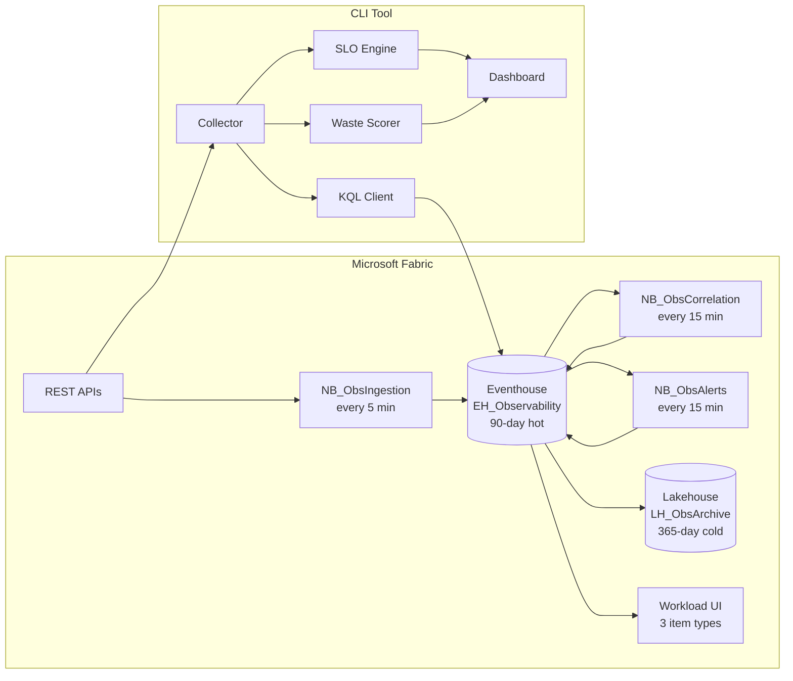

<p align="center">
  <strong>Observability Workbench for Microsoft Fabric</strong>
  <br>
  Long-retention monitoring, cross-item correlation, SLO tracking, and CU waste scoring -- open source, Fabric-native.
</p>

<p align="center">
  <a href="https://github.com/tenfingerseddy/FabricWorkloads/actions"></a>
  <a href="LICENSE"></a>
  
  
  <a href="https://github.com/tenfingerseddy/FabricWorkloads/stargazers"></a>
</p>

---

## Why This Exists

Fabric's built-in monitoring has three gaps that compound in production:

- **30-day retention ceiling** -- Monitoring Hub and Workspace Monitoring both cap at 30 days. No quarter-over-quarter trending, no long-term regression detection.
- **No cross-item correlation** -- A pipeline triggers a notebook that refreshes a semantic model. When the report is stale, there is no native way to trace the failure back through that chain.
- **No SLO framework** -- No way to define "pipeline X must succeed 99% of the time" or "refresh must complete within 2 hours," track compliance, or alert before a breach.

Observability Workbench fills all three gaps with an open-source CLI, Fabric notebooks, a KQL query pack, and a native Fabric workload.

## 30-Second Quickstart

```bash
git clone https://github.com/tenfingerseddy/FabricWorkloads.git
cd FabricWorkloads
npm install
```

Configure your service principal:

```bash
export FABRIC_TENANT_ID="your-tenant-id"
export FABRIC_CLIENT_ID="your-client-id"
export FABRIC_CLIENT_SECRET="your-client-secret"
```

Run:

```bash
npm start
```

Expected output:

```
Authenticating with Fabric API...            OK
Discovering workspaces...                    3 found
Collecting job instances...                  137 events
Computing SLOs...                            8 definitions evaluated
Scoring CU waste...                          4 items scored
Checking alert rules...                      2 breaches detected

=== Workspace Health Dashboard ===
  Pipelines: 12 OK | 2 Warning | 1 Failed
  SLO Compliance: 87.5% (7/8 passing)
  CU Waste Score: 73/100 (efficient)
```

Other modes:

```bash
npm run collect           # Collect only (no dashboard)
npm run dashboard         # Dashboard only (cached data)
npm run monitor           # Continuous monitoring (every 5 min)
npx fabric-health-check   # Quick health check (zero install)
```

## Architecture



**Four components work together:**

| Component | Location | What It Does |
|-----------|----------|-------------|
| CLI Tool | `src/` | Collect jobs, compute SLOs, score CU waste, detect alerts, render dashboard |
| Fabric Notebooks | `notebooks/` | Scheduled ingestion, correlation, and alerting inside Fabric |
| KQL Query Pack | `kql/` | 25+ ready-to-use analytical queries for Eventhouse |
| Fabric Workload | `workload/` | Native item types for dashboards, alerts, and SLO definitions |

## Features

### Working Now

- [x] **Job collection** -- Pipelines, notebooks, dataflows, copy jobs, semantic model refreshes
- [x] **KQL ingestion** -- Stream events into Eventhouse with 90-day hot / 365-day cold retention
- [x] **SLO tracking** -- Define success rate, duration, and freshness targets with error budgets
- [x] **Alerting engine** -- SLO breach, likely-to-breach, duration regression, consecutive failure detection
- [x] **Cross-item correlation** -- Automatic pipeline-to-notebook-to-refresh dependency linking
- [x] **CU waste scoring** -- Quantify retry, duration regression, and duplicate run waste in dollars
- [x] **Event search** -- Full-text search across all collected events (not limited to loaded data)
- [x] **Incident timeline** -- Chronological failure view with correlated upstream/downstream items
- [x] **CLI dashboard** -- Terminal-based workspace health, SLO grid, and alert summary
- [x] **Scheduled notebooks** -- Three production notebooks on 5/15/15-minute schedules
- [x] **Community query pack** -- 25 production-ready KQL queries ([browse them](kql/community-query-pack.kql))

### Planned

- [ ] **DevGateway integration** -- Run the workload UI locally against Fabric
- [ ] **Teams / Slack notifications** -- Alert routing to team channels
- [ ] **Lakehouse archive automation** -- Automated hot-to-cold tiering
- [ ] **SLO burndown charts** -- Visual error budget consumption over time
- [ ] **Shareable health reports** -- Export PDF/HTML workspace health cards
- [ ] **AppSource listing** -- One-click install from the Fabric marketplace

## Screenshots

*Screenshots coming soon -- the DevGateway integration for the workload UI is in progress. The CLI dashboard and KQL queries are fully functional today.*

## CU Waste Score

Every failed run, every duration regression, every duplicate execution costs real money. The CU Waste Score quantifies this per item:

| Waste Type | What It Measures |
|------------|-----------------|
| Retry waste | CU-seconds consumed by failed runs -- compute ran, output discarded |
| Duration waste | Excess CU-seconds from runs exceeding their P50 baseline |
| Duplicate waste | CU-seconds from overlapping concurrent runs of the same item |

Score is 0-100 (higher = more efficient). Monthly cost projections use F64 SKU pricing ($11.52/hr). Run the KQL version directly in your Eventhouse: [`kql/slo-queries.kql`](kql/slo-queries.kql).

## KQL Community Query Pack

The [`kql/`](kql/) directory contains 25+ KQL queries organized by use case:

- **Pipeline failure analysis** -- Root cause breakdown, failure trends, retry patterns
- **Capacity optimization** -- CU consumption heatmaps, peak usage windows, waste identification
- **Data freshness monitoring** -- Stale dataset detection, refresh lag tracking
- **Cross-item correlation** -- Dependency chain tracing, blast radius analysis
- **SLO compliance reporting** -- Error budget burn rate, compliance trends
- **Incident investigation** -- Timeline reconstruction, concurrent failure detection

The [community query pack](kql/community-query-pack.kql) (25 queries) is designed to drop directly into any Fabric Eventhouse. Each query includes documentation, expected output, and customization notes.

## Configuration

| Variable | Description | Required |
|----------|-------------|----------|
| `FABRIC_TENANT_ID` | Azure AD tenant ID | Yes |
| `FABRIC_CLIENT_ID` | Service principal client ID | Yes |
| `FABRIC_CLIENT_SECRET` | Service principal secret | Yes |
| `KQL_ENABLED` | Enable Eventhouse ingestion (`true`/`false`) | No |
| `KQL_QUERY_ENDPOINT` | Eventhouse query URI | When KQL enabled |
| `KQL_DATABASE` | KQL database name | When KQL enabled |

## KQL Eventhouse Tables

| Table | Purpose | Retention |
|-------|---------|-----------|
| `FabricEvents` | All job instances with status, duration, timestamps | 90 days |
| `WorkspaceInventory` | Item catalog across workspaces | 90 days |
| `EventCorrelations` | Cross-item dependency links | 90 days |
| `SloDefinitions` | SLO target configurations | Permanent |
| `SloSnapshots` | Point-in-time SLO measurements | 90 days |
| `AlertRules` | Alert rule definitions | Permanent |
| `AlertLog` | Triggered alert history | 90 days |

## Fabric Workload Item Types

The workload adds three native item types to Fabric:

- **WorkbenchDashboard** -- SLO grid, CU waste scoring, incident timeline, failed jobs
- **AlertRule** -- Condition builder, notification targets, test-fire capability
- **SLODefinition** -- Metric configuration, error budget visualization, threshold tuning

## Project Structure

```
src/                    # CLI tool (TypeScript)
  collector.ts          #   Workspace discovery, job collection, correlation
  alerts.ts             #   Alert engine (breach, regression, freshness)
  waste-score.ts        #   CU Waste Score calculator
  kql-client.ts         #   Eventhouse ingestion
  dashboard.ts          #   Terminal dashboard renderer
  hooks/                #   React hooks for workload frontend
  services/             #   Backend service layer
  __tests__/            #   268 tests (vitest)
workload/               # Fabric Extensibility Toolkit workload
  app/items/            #   3 item types with editors and views
  Manifest/             #   Fabric manifests and item definitions
kql/                    # 25+ KQL queries by use case
notebooks/              # 3 Fabric PySpark notebooks
packages/               # Standalone tools (fabric-health-check)
scripts/                # Deployment and validation
landing-page/           # Marketing site with pricing
```

## Roadmap

See the full [product specification](products/observability-workbench/specs/product-spec.md) for detailed plans.

**Near-term:**
- DevGateway workload UI testing
- Teams and Slack alert integrations
- Automated Lakehouse archive tiering
- SLO template library (community-contributed)

**Future products in the pipeline:**
- **Release Orchestrator** -- Dependency-aware, test-gated deployments for Fabric
- **FinOps Guardrails** -- Cost transparency, chargeback, and budget controls
- **Schema Drift Gate** -- Data contracts, drift detection, promotion gates

## Pricing

The open-source CLI, KQL queries, and notebooks are **free forever** (MIT license).

| Tier | Price | Workspaces | Retention | SLOs |
|------|-------|-----------|-----------|------|
| Free | $0 | 1 | 7 days | 5 |
| Professional | $499/mo per capacity | 5 | 90 days | Unlimited |
| Enterprise | $1,499/mo per capacity | Unlimited | 365 days | Unlimited + SSO + SLA |

See the [pricing page](landing-page/) for full details.

## Testing

```bash
npm test              # Run all 268 tests
npm run test:watch    # Watch mode
npx tsc --noEmit      # Type check
npm run validate:notebooks  # Validate notebook format
```

## Resources

- [Product Specification](products/observability-workbench/specs/product-spec.md) -- Architecture, data models, API design
- [KQL Community Query Pack](kql/community-query-pack.kql) -- 25 production-ready queries
- [Blog: The State of Fabric Observability in 2026](https://dev.to/observability-workbench/the-state-of-fabric-observability-in-2026)
- [Blog: Cross-Item Correlation in Microsoft Fabric](https://dev.to/observability-workbench/cross-item-correlation-in-microsoft-fabric)

## Contributing

We welcome contributions -- KQL queries, bug reports, feature requests, documentation, and code.

See [CONTRIBUTING.md](CONTRIBUTING.md) for setup instructions, code style, and PR guidelines.

## License

MIT -- see [LICENSE](LICENSE).

---

<p align="center">
  If this project is useful to you, <a href="https://github.com/tenfingerseddy/FabricWorkloads">give it a star on GitHub</a>. It helps others find it.
</p>
